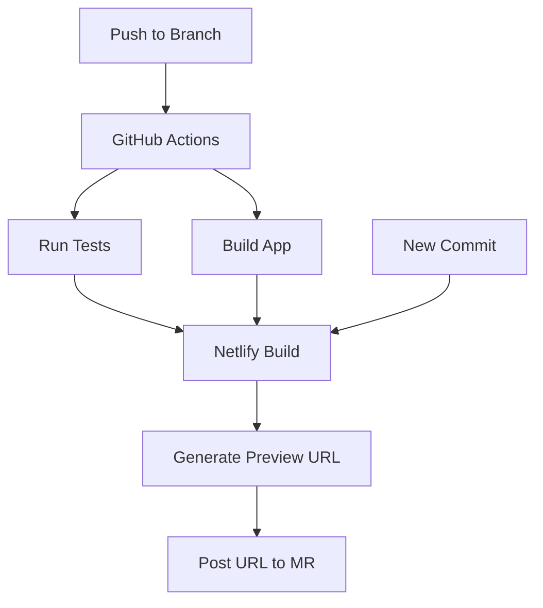

# Memverse PWA: Technical Documentation

This document provides technical details about the Memverse Progressive Web App (PWA) implementation
and how the Netlify preview deployment process works with merge requests.

## PWA Implementation

### Core Technologies

- **Service Worker**: Enables offline functionality and resource caching
- **Web App Manifest**: Defines the app's appearance when installed
- **Workbox**: Used for service worker generation and route handling
- **IndexedDB**: Stores user data locally for offline use

### Key Files

- `manifest.json`: Contains app metadata (name, icons, theme colors)
- `service-worker.js`: Manages caching strategies and offline functionality
- `index.html`: Contains necessary meta tags and PWA-related links
- `offline.html`: Fallback page shown when offline without cached content

### Caching Strategy

Memverse uses a combination of caching strategies:

1. **Cache-first** for static assets: CSS, JavaScript, images
2. **Network-first** for API requests: Fetches fresh data when online, falls back to cached data
   when offline
3. **Stale-while-revalidate** for semi-dynamic content: Shows cached content immediately while
   updating in the background

```javascript
// Example service worker caching configuration
workbox.routing.registerRoute(
  /\.(?:js|css)$/,
  new workbox.strategies.CacheFirst({
    cacheName: 'static-resources',
    plugins: [
      new workbox.expiration.ExpirationPlugin({
        maxEntries: 60,
        maxAgeSeconds: 30 * 24 * 60 * 60, // 30 days
      }),
    ],
  })
);
```

### Offline Functionality

- Verses previously viewed are stored in IndexedDB
- User progress is tracked locally and synced when online
- Background sync is used to queue actions performed while offline

## Netlify Deployment and Preview Process

### Continuous Integration Workflow

1. Code is pushed to a branch
2. GitHub Actions run tests and build the app
3. Netlify builds a preview deployment
4. A unique preview URL is generated

### Merge Request Integration

When a merge request (MR) is created:

1. Netlify automatically builds a preview deployment
2. The preview URL is posted as a comment on the MR
3. Each commit to the MR triggers a rebuild of the preview
4. The preview deployment includes the PWA functionality



### Netlify Configuration

The `netlify.toml` file defines the build settings:

```toml
[build]
command = "flutter build web --release --web-renderer canvaskit"
publish = "build/web"

[context.deploy-preview]
command = "flutter build web --release --web-renderer canvaskit --dart-define=ENVIRONMENT=staging"

[context.branch-deploy]
command = "flutter build web --release --web-renderer canvaskit --dart-define=ENVIRONMENT=development"
```

Each deployment context (`production`, `deploy-preview`, `branch-deploy`) can have different
environment variables and build commands.

### Preview URL Format

Preview URLs follow this format:

```
https://deploy-preview-{PR_NUMBER}--{SITE_NAME}.netlify.app
```

For example: `https://deploy-preview-42--memverse-app.netlify.app`

### Testing PWA on Preview Deployments

The preview deployments include full PWA functionality for testing:

1. Service workers are enabled
2. The web app manifest is included
3. The app can be installed from the preview URL

Testers should note that:

- Each preview deployment has its own cache and storage
- Data is not shared between previews or production
- The preview URL must be added to the service worker's allowed origins

## PWA Audit and Optimization

Use Lighthouse to audit the PWA implementation:

```bash
# Install Lighthouse CLI
npm install -g lighthouse

# Run audit
lighthouse https://memverse.com --view
```

Key metrics to monitor:

- First Contentful Paint (FCP)
- Largest Contentful Paint (LCP)
- Time to Interactive (TTI)
- First Input Delay (FID)
- Cumulative Layout Shift (CLS)

## Security Considerations

- HTTPS is enforced for all communications
- Content Security Policy (CSP) restricts resource loading
- Service worker scope is limited to the app's domain
- Local storage data is encrypted when containing sensitive information

## References

- [Google PWA Documentation](https://web.dev/progressive-web-apps/)
- [Workbox Documentation](https://developers.google.com/web/tools/workbox)
- [Netlify Deploy Previews](https://docs.netlify.com/site-deploys/deploy-previews/)
- [Flutter Web PWA Guide](https://docs.flutter.dev/platform-integration/web/pwa)